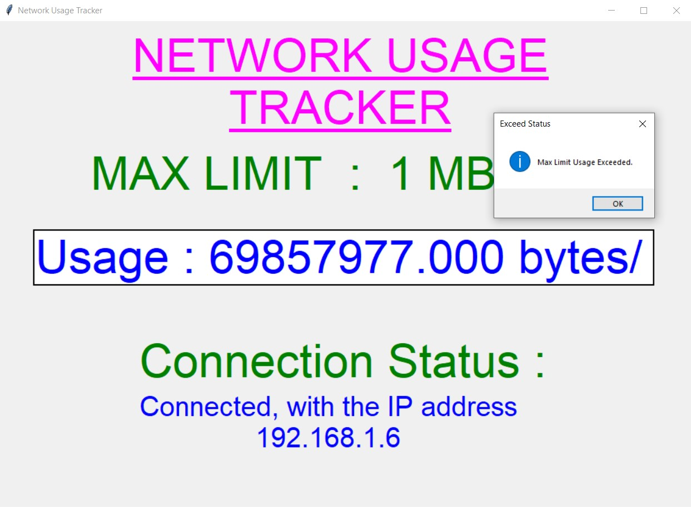
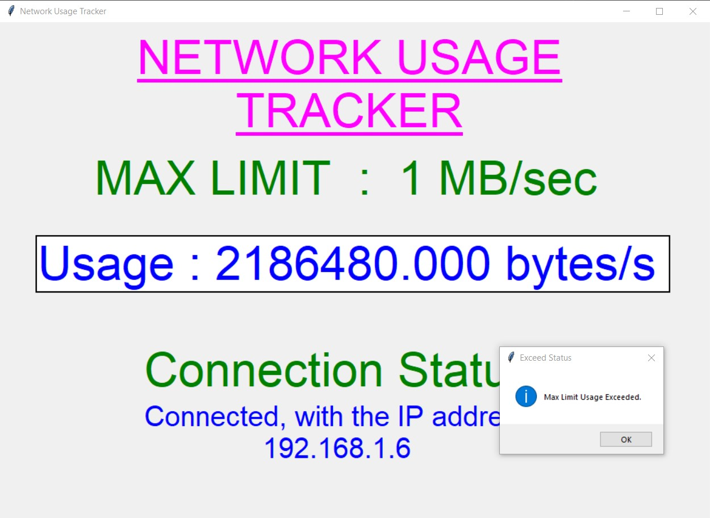

# Network Usage Tracker

The Network Usage Tracker is a Python application with a Tkinter GUI that allows users to monitor the network usage on their PC or computer in real-time. It provides features such as setting a maximum limit for network usage, receiving notifications when the limit is exceeded, and displaying the connection status and IP address.

### Prerequisites
Before running the script, make sure you have installed the required dependencies. You can install them by executing the following command:
```
pip install -r requirements.txt
```

### How to Run the Script
Follow the steps below to run the Network Usage Tracker:

1. Clone or download the code file, `network_usage_tracker.py`, to your local system.
2. Open a terminal or command prompt and navigate to the directory where the script is located.
3. Run the following command to start the script:
```
python network_usage_tracker.py
```
4. The script will start running, and the Tkinter GUI will be displayed.
5. You can monitor the network usage in real-time, check the connection status, and view the IP address.
6. Set the maximum limit for network usage, and if the usage exceeds the limit, you will be notified.

### Sample Screenshots
Below are some sample screenshots showcasing the usage of the Network Usage Tracker:

<p align="center">
  <br>
  <br>
  <br>
  <br>
  <br>
  <br>
  <br>
  <br>
</p>